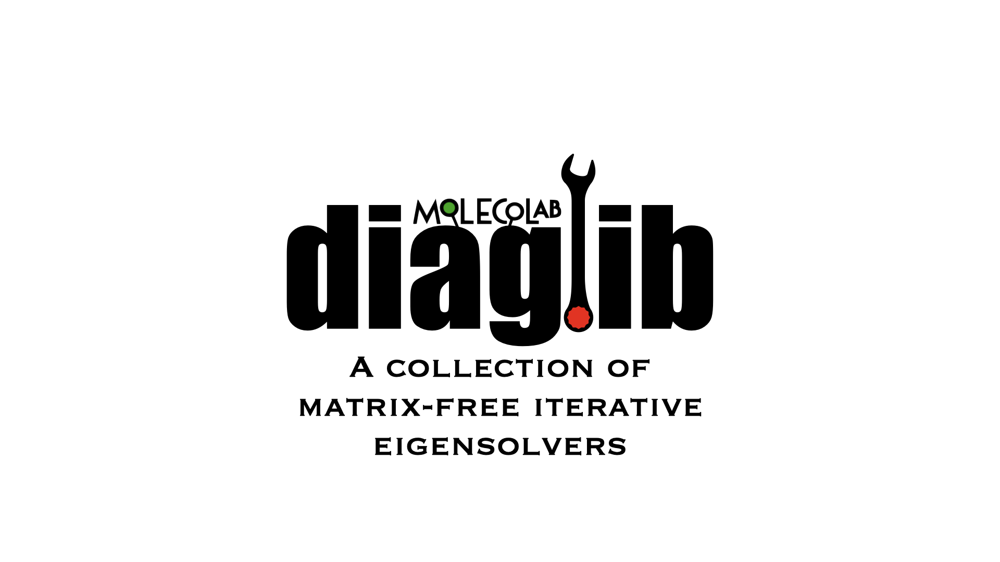

## A collection of iterative, matrix-free eigensolvers

DiagLib is an opensource project hosted at GitHub.

@todo
Missing documentation includes:

- Adding examples of generic usage
- Adding examples of usage for generalized problems
- Fix definition of usable memory (discrepancy MBs vs size)
@endtodo
